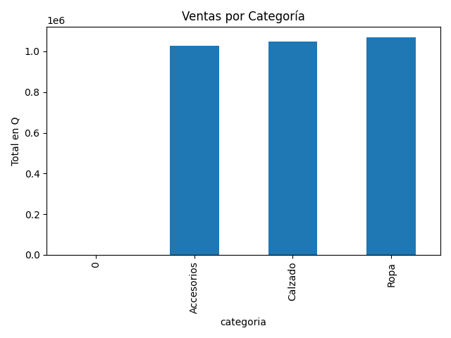
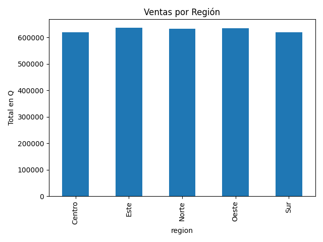
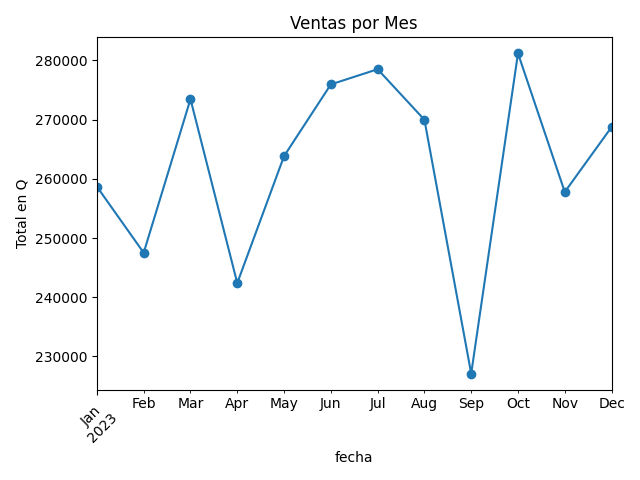
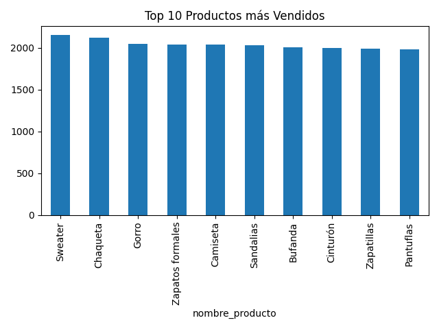
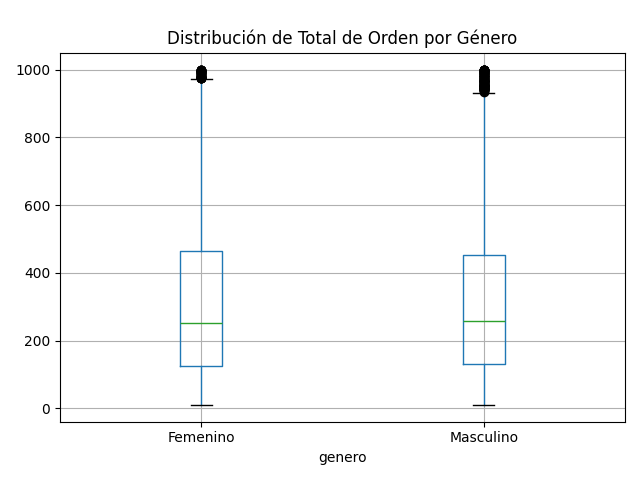
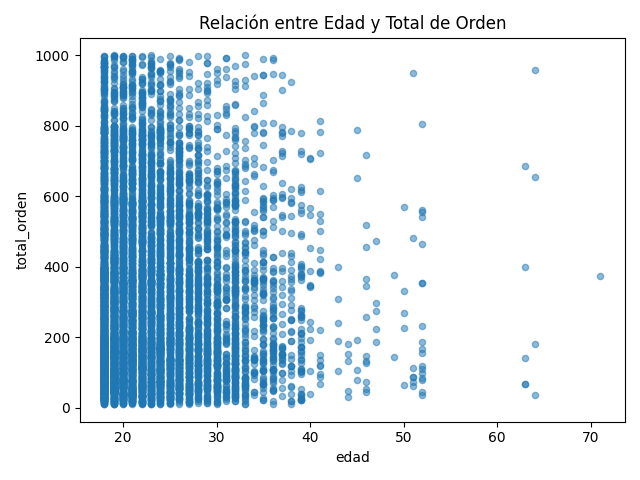
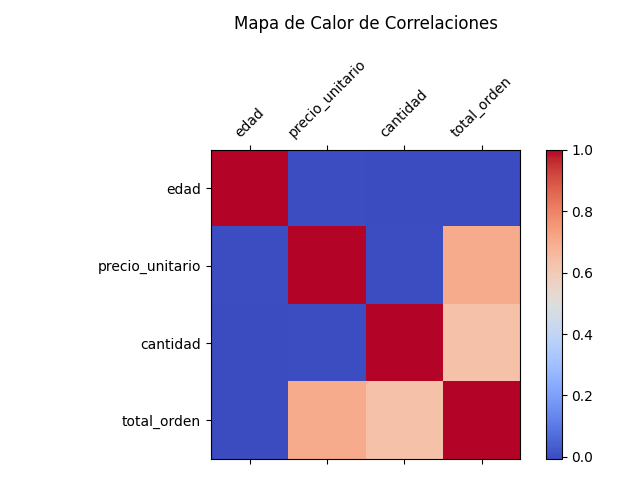

# Análisis de datos Grupo 20

**Alberto Gabriel Reyes Ning**
**Carné: 201612174**

**Kelly Mischel Herrera Espino**
**Carné: 201900716**

## Análisis exploratorio
### a. Estadísticas básicas
|        |    edad |   precio_unitario |   cantidad |   total_orden |
|:-------|--------:|------------------:|-----------:|--------------:|
| mean   | 22.9574 |           104.876 |     2.9995 |       314.509 |
| median | 21      |           104.84  |     3      |       254.84  |
| mode   | 18      |            17.97  |     2      |       150.2   |

### b. Visualizaciones

## Análisis de tendencias

## Segmentación de clientes

## Análisis de correlación

## Resumen de insights clave
- La categoría con mayores ventas fue **Ropa** con Q1068318.43.
- La región con mayores ventas fue **Este** con Q637283.44.
- El mes con mayores ventas fue **October 2023** y el mes con menores ventas fue **September 2023**.
- El producto más vendido fue **Sweater** con un total de 2152 unidades.
- En promedio, **Masculino** gastó más por orden con Q314.90.

## Conclusiones
- [ ] Se observo que en la categoría ropa presnta l amayor parte de las ventas,lo cual es un indicador de una fuerte preferencia del mercado por este tipo de productos.

-  [ ] En el caso de la región Este se observo una concentración de la mayoría de las ventas, lo que sugiere una mayor presencia de clientes.
-  [ ] El producto Sweater se observó que es el más vendido, lo que podría estar relacionado con la estación o la popularidad de la prenda.
-  [ ] En el caso del genero masculino, se observo que realiza pedidos con un ticket promedio alto, por lo que campañas de marketing personalizadas podrian maximizar los ingresos.

## Recomendaciones 
-  [ ] Implementar camapañas de promoción con productos de ropa relacionados a los sueteres para aumentar el valor del carrito.
-  [ ] Auemntar la inversión en la publicadida o logistica en la region Este para capitalizar la demanda existente..
## 8. Preguntas
- [ ] ¿Cómo podrían los insights obtenidos ayudar a diferenciarse de la competencia?
- [ ] Alberto Gabriel Reyes Ning:
Se puede disñear estretigas enfocadas que la competencias podria obtener, esto con la ayuda de los insights debido a que estan basado en datos reales del comportamiento del cliente, esto permite tomar decisiones.
- [ ] Kelly Mischel Herrera Espino:
Los insights permite un refuerzo en la personalización, es decir que se pueden lanzar campañas especificas, aumentando la fidelización de los clientes tomando en cuenta que segmento o grupo gasta más en ciertos productos.

- [ ] ¿Qué decisiones estratégicas podrían tomarse basándose en este análisis?
- [ ] Alberto Gabriel Reyes Ning:
Un refuerzo en el tema del inventario en productos más vendidos como sueteres y realizar un aumento en el marketing en la región.
- [ ] Kelly Mischel Herrera Espino:
Aplicar promociones en las categoría de ropa, adaptando el contenido de marketing por genero y asi tener un enfoque personalizado para estos grupos.

- [ ] ¿Cómo podría este análisis de datos ayudar a la empresa a ahorrar costos o mejorar la eficiencia?
- [ ] Alberto Gabriel Reyes Ning:
Al obtener las regiones que registran menos ventas se puede realizar un ajuste en las rutas de envío y reduicr costos de logisticas innecesarios.
- [ ] Kelly Mischel Herrera Espino:
Se puede evitar un sobrestock en productos que tienen una baja rotación, optimizando asi los recursos de bodega.

- [ ] ¿Qué datos adicionales recomendarían recopilar para obtener insights aún más valiosos?
- [ ] Alberto Gabriel Reyes Ning:
Un historial de navegación para idientificar intereses no convertidos.
- [ ] Kelly Mischel Herrera Espino:
Datos sobre devoluciones y tambien reseñas de productos, esto para poder entender la satisfacción del cliente.
