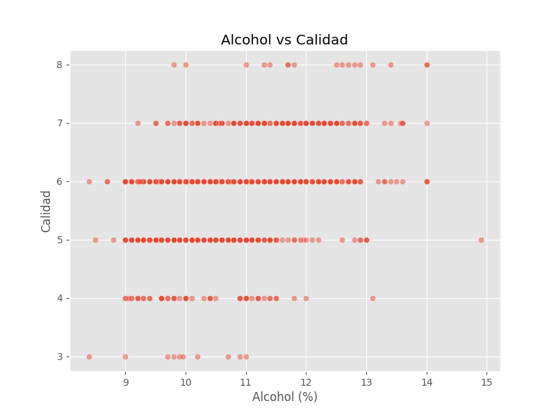

# **Analisis de Calidad del Vino**

## Alberto Gabriel Reyes Ning, 201612174
## SOG2 1S25 - Tarea 3

## Estadisticas Descriptivas
- **fixed acidity**: Media = 8.31, Desviacion Estandar = 1.74
- **volatile acidity**: Media = 0.53, Desviacion Estandar = 0.18
- **citric acid**: Media = 0.27, Desviacion Estandar = 0.20
- **residual sugar**: Media = 2.52, Desviacion Estandar = 1.35
- **chlorides**: Media = 0.09, Desviacion Estandar = 0.05
- **free sulfur dioxide**: Media = 15.89, Desviacion Estandar = 10.45
- **total sulfur dioxide**: Media = 46.83, Desviacion Estandar = 33.41
- **density**: Media = 1.00, Desviacion Estandar = 0.00
- **pH**: Media = 3.31, Desviacion Estandar = 0.16
- **sulphates**: Media = 0.66, Desviacion Estandar = 0.17
- **alcohol**: Media = 10.43, Desviacion Estandar = 1.08
- **quality**: Media = 5.62, Desviacion Estandar = 0.82

## Conclusiones
- Los vinos con mayor contenido de alcohol tienden a tener mejor calidad.
- La acidez volatil afecta negativamente la calidad del vino.
- Existen valores atipicos en los niveles de dioxido de azufre.

## Visualizaciones

